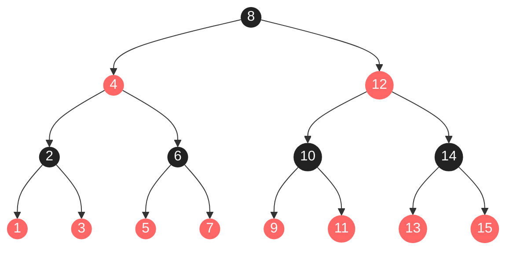
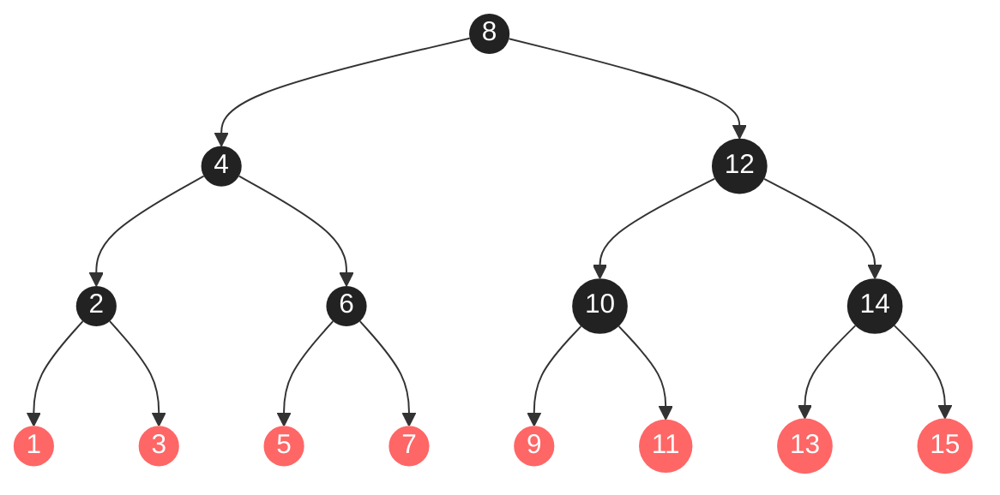
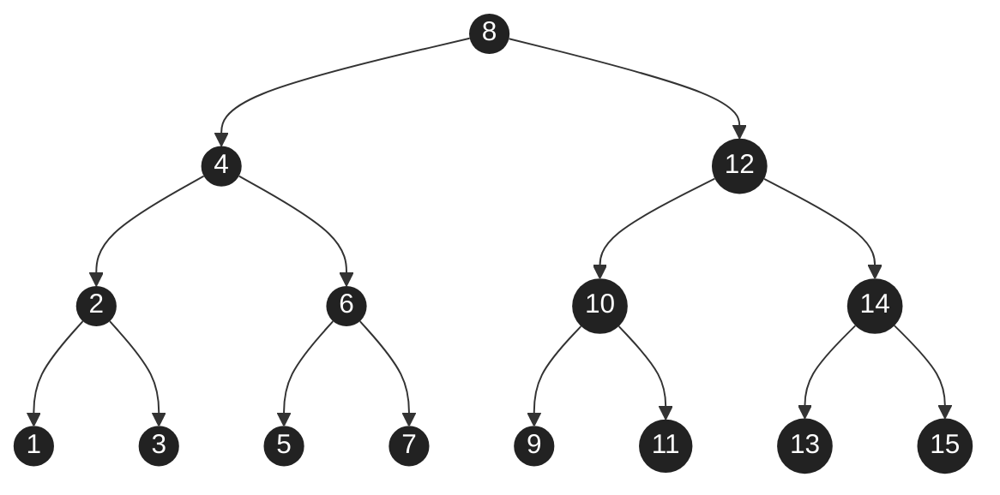
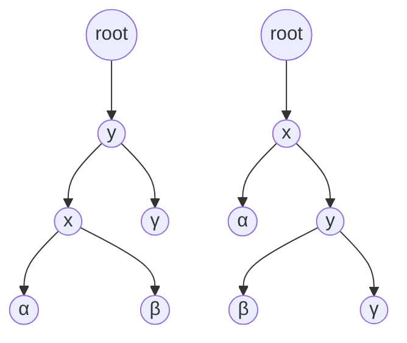
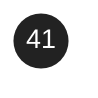
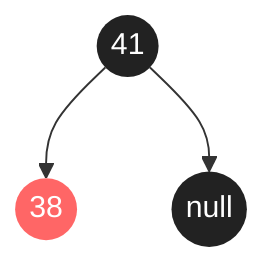
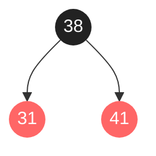
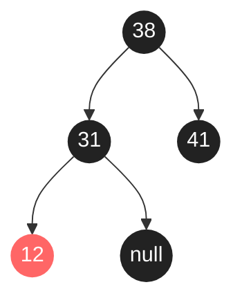
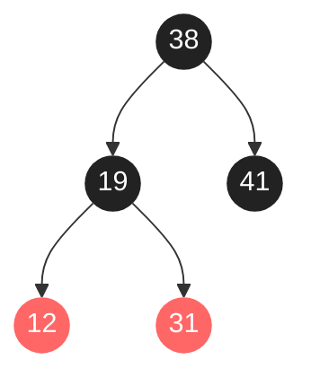
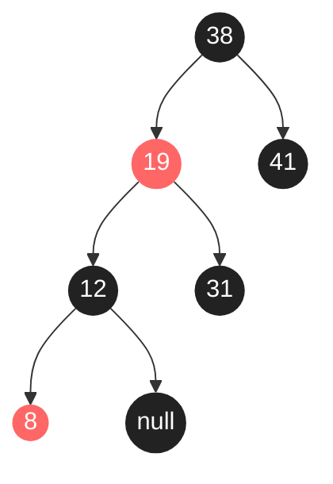

# Chapter 13 Red-Black Tree

## 13.1 Properties of red-black trees

*红黑树*是二叉搜索树，每个节点有一个额外的存储位：它的*颜色*，可以是`红色`或`黑色`。
A *red-black tree* is a binary search tree with one extra bit of storage per node: its *color*, which can be either `RED` or `BLACK`.

A red-black tree is a binary search tree that satisûes the following red-black properties:

1. Every node is either red or black.
2. The root is black.
3. Every leaf (NIL) is black.
4. If a node is red, then both its children are black.
5. For each node, all simple paths from the node to descendant leaves contain the same number of black nodes.

我们把从一个节点 $x$ （不包含）向下到一个叶节点的任何简单路径上的黑色节点数量称为该节点的黑色高度，表示为 $\mathrm{bh}(x)$。
We call the number of black nodes on any simple path from, but not including, a node $x$ down to a leaf the black-height of the node, denoted $\mathrm{bh}(x)$.

### Lemma 13.1

A red-black tree with $n$ internal nodes has height at most $2\log(n+1)$.

#### Proof

If the height of $x$ is 0, then $x$ must be a leaf (Nil), and the subtree rooted at $x$ indeed contains at least $2^{\mathrm{bh}(x)}-1=2^0-1=0$ internal nodes.

Consider a node $x$ that has positive height and is an internal node. Then node $x$ has two children, either or both of which may be a leaf. If a child is black, then it contributes 1 to $x$'s black-height but not to its own. If a child is red, then it contributes to neither $x$'s black-height nor its own. Therefore, each child has a black-height of either $\mathrm{bh}(x)-1$ (if it’s black) or $\mathrm{bh}(x)$ (if it's red). Thus, the subtree rooted at $x$ contains at least $2\cdot(2^{\mathrm{bh}(x)-1}-1)+1=2^{\mathrm{bh}(x)}-1$ internal nodes.

Therefore, **the subtree rooted at any node x contains at least $2^{\mathrm{bh}(x)}-1$ internal nodes.**

Let $h$ be the height of the tree. **According to property 4, at least half the nodes on any simple path from the root to a leaf, not including the root, must be black.** Consequently, the black-height of the root must be at least $h/2$, and thus,
$$
\begin{align*}
n&\ge2^{h/2}-1\\
h&\le2\log(n+1)
\end{align*}
$$

### Exercises

#### 13.1-1

> In the style of Figure 13.1(a), draw the complete binary search tree of height 3 on the keys $\{1,2,\dots,15\}$. Add the NIL leaves and color the nodes in three different ways such that the black-heights of the resulting red-black trees are 2, 3, and 4.

2 black-height.



3 black-height.



4 black-height.



## 13.2 Rotations



Left rotation: on a node $x$, which transforms the structure on the *right* side of the figure to the structure on the *left*.

Right rotation: on a node $y$, which transforms the structure on the *left* side of the figure to the structure on the *right*.

```python
def LeftRotate(T, x):
    y = x.right
    x.right = y.left         # turn y's left subtree into x's right subtree
    if y.left is not None:   # if y's left subtree is not empty
        y.left.parent = x    # then x becomes the parent of the subtree's root
    y.parent = x.parent      # x's parent becomes y's parent
    if x.parent is None:     # if x was the root
        T.root = y           # then y becomes the root
    elif x == x.parent.left: # otherwise, if x was a left child
        x.parent.left = y    # then y becomes a left child
    else:
        x.parent.right = y   # otherwise, x was a right child, and now y is
    y.left = x               # make x become y's left child
    x.parent = y
```

### Exercises

#### 13.2-1

> Write pseudocode for `RIGHT-ROTATE`.

```python
def RightRotate(T, x):
    y = x.left
    x.left = y.right
    if y.right is not None:
        y.right.parent = x
    y.parent = x.parent
    if x.parent is None:
        T.root = y
    elif x == x.parent.left:
        x.parent.left = y
    else:
        x.parent.right = y
    y.right = x
    x.parent = y
```

#### 13.2-2

> Argue that in every $n$-node binary search tree, there are exactly $n-1$ possible rotations.

We can perform the rotation on each edge of tree. There are $n-1$ edges in an $n$-node binary tree.

#### 13.2-3

> Let $a$, $b$, and $c$ be arbitrary nodes in subtrees $\alpha$, $\beta$ and $\gamma$, respectively, in the right tree of Figure 13.2. How do the depths of $a$, $b$, and $c$ change when a left rotation is performed on node $x$ in the figure?

$$
a\gets a+1,b\gets b,c\gets c-1
$$

## 13.3 Insertion

The procedure `RB-INSERT` starts by inserting node $z$ into the tree $T$ as if it were an ordinary binary search tree, and then it colors $z$ red.

```python
def RBInsert(T, z):
    x = T.root        # node being compared with z
    y = T.nil         # y will be parent of z
    while x != T.nil: # descend until reaching the sentinel
        y = x
        if z.key < x.key:
            x = x.left
        else:
            x = x.right
    z.parent = y      # found the location -- insert z with parent y
    if y == T.nil:
        T.root = z    # tree T was empty
    elif z.key < z.key:
        y.left = z
    else:
        y.right = z
    z.left = T.nil    # both of z's children are the sentinel
    z.right = T.nil
    z.color = RED     # the new node starts out red
    RBInsertFixup(T, z)
```

Property 2, "The root is black." is violated if `z` is the root.

Property 4, "If a node is red, then both its children are black." is violated if `z`'s parent is red.

```python
def RBInsertFixup(T, z):
    while z.parent.color == RED:
        if z.parent == z.parent.parent.left: # is z's parent a left child?
            y = z.parent.parent.right        # y is z's uncle
            if y.color == RED:               # are z's parent and uncle both red?
                z.parent.color = BLACK       # case 1
                y.color = BLACK
                z.parent.parent.color = RED
                z = z.parent.parent
            else:
                if z == z.parent.right:      # case 2
                    z = z.parent
                    LeftRotate(T, z)
                z.parent.color = BLACK       # case 3
                z.parent.parent.color = RED
                RightRotate(T, z.parent.parent)
        else: # same as lines 4-16, but with "right" and "left" exchanged
            y = z.parent.parent.left
            if y.color == RED:
                z.parent.color = BLACK
                y.color = BLACK
                z.parent.parent.color = RED
                z = z.parent.parent
            else:
                if z == z.parent.left:
                    z = z.parent
                    RightRotate(T, z)
                z.parent.color = BLACK
                z.parent.parent.color = RED
                LeftRotate(T, z.parent.parent)
    T.root.color = BLACK
```

Loop invariant:

1. Node `z` is red.
2. If `z.parent` is the root, then `z.parent` is black.
3. If the tree violates any of the red-black properties, then it violates at most one of them, and the violation is of either property 2 or property 4, but not both. If the tree violates property 2, it is because `z` is the root and is red. If the tree violates property 4, it is because both `z` and `z.parent` are red.

Initialization:

Before RB-INSERT is called, the red-black tree has no violations. `RB-INSERT` adds a red node `z` and calls `RB-INSERT-FIXUP`.

1. When `RB-INSERT-FIXUP` is called, `z` is the red node that was added.
2. If `z.parent` is the root, then `z.parent` started out black and did not change before the call of `RB-INSERT-FIXUP`.
3. If the tree violates property 2, then the red root must be the newly added node `z`. Because the parent and both children of `z` are the sentinel, which is black, the tree does not also violate property 4. If the tree violates property 4, then, because the children of node `z` are black sentinels and the tree had no other violations prior to `z` being added, the violation must be because both `z` and `z.parent` are red.

Maintenance:

The node `z.parent.parent` exists, since by part 2 of the loop invariant, if `z.parent` is the root, then `z.parent` is black. Since `RB-INSERT-FIXUP` enters a loop iteration only if `z.parent` is red, we know that `z.parent` cannot be the root. Hence, `z.parent.parent` exists.

In all three cases, `z`'s grandparent `z.parent.parent` is black, since its parent `z.parent` is red, and property 4 is violated only between `z` and `z.parent`.

Case 1: `z`'s uncle `y` is red.

Because `z`'s grandparent `z.parent.parent` is black, its blackness can transfer down one level to both `z.parent` and `y`, thereby fixing the problem of `z` and `z.parent` both being red. Having had its blackness transferred down one level, `z`'s grandparent becomes red, thereby maintaining property 5. The `while` loop repeats with `z.parent.parent` as the new node `z`, so that the pointer `z` moves up two levels
in the tree.

1. Because this iteration colors `z.parent.parent` red, node `z'` is red at the start of the next iteration.
2. The node `z'.parent` is `z.parent.parent.parent` in this iteration, and the color of this node does not change. If this node is the root, it was black prior to this iteration, and it remains black at the start of the next iteration.
3. If node `z'` is the root at the start of the next iteration, property 2 becomes the only one that is violated. Otherwise, `z'.parent` was black, there is no violation of property 4. If `z'.parent` was red, coloring `z'` red created one violation of property 4.

Case 2/3: `z`'s uncle `y` is black and `z` us a right/left child.

A left rotation immediately transforms the case 2 into case 3. Because both `z` and `z.parent` are red, the rotation affects neither the black-heights of nodes nor property 5. Case 3 performs some color changes and a right rotation, which preserve property 5.

1. Case 2 makes `z` point to `z.parent`, which is red. No further change to `z` or its color occurs in cases 2 and 3.
2. Case 3 makes `z.parent` black, so that if `z.parent` is the root at the start of the next iteration, it is black.
3. Since node `z` is not the root in cases 2 and 3, we know that there is no violation of property 2. Cases 2 and 3 correct the lone violation of property 4, and they do not introduce another violation.

Termination:

If only case 1 occurs, then the node pointer `z` moves toward the root in each iteration, so that eventually `z.parent` is black. If either case 2 or case 3 occurs, then we’ve seen that the loop terminates.

### Analysis

In `RB-INSERT-FIXUP`, the while loop repeats only if case 1 occurs, and then the pointer `z` moves two levels up the tree. The total number of times the `while` loop can be executed is therefore $O(\log n)$. Thus, `RB-INSERT` takes a total of $O(\log n)$ time.

### Exercises

#### 13.3-1

> Line 16 of `RB-INSERT` sets the color of the newly inserted node `z` to red. If instead `z`'s color were set to black, then property 4 of a red-black tree would not be violated. Why not set `z`'s color to black?

Property 5 is violated.

#### 13.3-2

> Show the red-black trees that result after successively inserting the keys 41, 38, 31, 12, 19, 8 into an initially empty red-black tree.













## 13.4 Deletion

```python
def RBTransplant(T, u, v):
    if u.parent == T.nil:
        T.root = v
    elif u == u.parent.left:
        u.parent.left = v
    else:
        u.parent.right = v
    v.parent = u.parent
```

```python
def RBDelete(T, z):
    y = z
    y_original_color = y.color
    if z.left == T.nil:
        x = z.right
        RBTransplant(T, z, z.right)     # replace z by its right child
    elif z.right == T.nil:
        x = z.left
        RBTransplant(T, z, z.left)      # replace z by its left child
    else:
        y = TreeMinimum(z.right)        # y is z's successor
        y_original_color = y.color
        x = y.right
        if y != z.right:                # is y farther down the tree?
            RBTransplant(T, y, y.right) # replace y by its right child
            y.right = z.right           # z's right child becomes y's right child
            y.right.parent = y
        else:
            x.parent = y                # in case x is T.nil
        RBTransplant(T, z, y)           # replace z by its successor y
        y.left = z.left                 # and give z's left child to y, which had no left child
        y.left.parent = y
        y.color = z.color
    if y_original_color == BLACK:       #  if any red-black violations occurred, correct them
        RBDeleteFixup(T, x)
```


